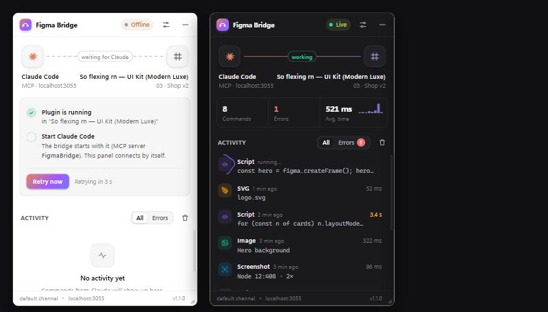

# Figma Bridge

**Let any AI agent design in the Figma desktop app, with no rate limits.**

Figma Bridge is a local [MCP](https://modelcontextprotocol.io) server plus a Figma plugin. Your agent gets full read and
write access to the open file through the Plugin API, not the web API: no tokens, no quotas.

Works with **Claude Code**, **Claude Desktop**, **Codex**, **Antigravity**, **Gemini CLI**, **Cursor**, **Windsurf**
and any other MCP client.

<p align="center"></p>

## Features

- **Build whole layouts in one call** from a JSON spec: auto-layout and grid, rich text, icons, images, component sets with variants and properties, prototype links.
- **Write the design system**: variables with Light/Dark modes and styles, from simple JSON, W3C design tokens or a Tailwind theme.
- **Read existing designs** compactly, search every page, and reuse the file's design system.
- **Check its own work** with screenshots, a design audit, and a pixel diff against a mockup.
- **Hand off**: Dev Mode annotations and export to HTML or React (CSS or Tailwind).
- **200 000+ icons** through Iconify, checkpoints to roll back, and a library of reusable scripts.
- **Zero-friction connection**: the plugin connects and reconnects on its own. Each AI command is one Ctrl+Z step, and you can cancel it from the plugin.

## Installation

Requires [Bun](https://bun.sh) and the Figma **desktop** app.

1. Download the [latest release](https://github.com/Clovis500c/figma-bridge/releases/latest), unzip it, and run in that folder:

   ```bash
   bun install
   ```

   ```bash
   bun run setup
   ```

   `setup` finds the AI clients installed on your machine and adds Figma Bridge to each of them (originals are backed up).

2. In Figma: **Plugins → Development → Import plugin from manifest…** and select `plugin/manifest.json`.

3. Restart your AI client, open a Figma file and run **Plugins → Development → Figma Bridge**. A green **Live** badge means it's connected.

<details>
<summary>Manual configuration</summary>

`bun run setup --print` prints these snippets with your paths. To target one client: `bun run setup --client codex`.

Most clients (`mcpServers` in their JSON config):

```json
{
  "mcpServers": {
    "FigmaBridge": {
      "command": "C:\\Users\\you\\.bun\\bin\\bun.exe",
      "args": ["run", "C:\\Users\\you\\figma-bridge\\src\\server.ts"]
    }
  }
}
```

Codex (`~/.codex/config.toml`):

```toml
[mcp_servers.FigmaBridge]
command = 'C:\Users\you\.bun\bin\bun.exe'
args = ['run', 'C:\Users\you\figma-bridge\src\server.ts']
```

| Client | Config file |
|---|---|
| Claude Code | `~/.claude.json` |
| Claude Desktop | `%APPDATA%\Claude\claude_desktop_config.json` |
| Codex | `~/.codex/config.toml` |
| Antigravity | `~/.gemini/antigravity/mcp_config.json` (or **Manage MCP Servers → View raw config**) |
| Gemini CLI | `~/.gemini/settings.json` |
| Cursor | `~/.cursor/mcp.json` |
| Windsurf | `~/.codeium/windsurf/mcp_config.json` |

</details>

## Usage

Keep the plugin open (the **—** button collapses it to a thin bar) and ask your agent, for example:

> Design a mobile sign-in screen from scratch on a new page: logo, email and password fields, a primary button and a "Forgot password?" link.

> Create our design system from `tokens.json` (Light and Dark modes), then rebuild the selected screen with those variables and show it in Dark mode.

> Reproduce `C:\mockups\dashboard.png` as an editable frame with auto-layout, compare it with the screenshot and fix the differences.

When your agent needs you to point at something, the plugin shows **Your agent is waiting** until you select it.
A running command has a **Cancel** button: `build` stops at the next layer, but a script cannot be interrupted and
finishes in the background.

To reopen the plugin later, use **Ctrl+Alt+P** or the **Figma Bridge** button in the right panel.

## Tools

| Tool | Purpose |
|---|---|
| `build` | Create a layout from a JSON spec in one call: grid, rich text, variants, reactions |
| `run_script` | Run any Figma Plugin API code |
| `describe` | Compact outline of existing layers |
| `find` | Search layers on every page by name, text, type, style or component |
| `get_design_system` | Local styles, variables and components |
| `design_tokens` | Create or update variables (with modes) and styles from JSON, W3C tokens or Tailwind |
| `audit` | Lint for contrast, overflow, fonts, spacing and naming |
| `screenshot` | Export a layer to an image (optionally shown to the agent) |
| `compare` | Pixel-diff a layer against a reference image, with a heatmap |
| `wait_for_selection` | Ask the user to select layers and wait for it |
| `prototype` | Link frames (click, hover, transitions) and set flow starting points |
| `annotate` | Add, list or clear Dev Mode annotations |
| `export_code` | Export a frame to HTML or React, with CSS or Tailwind |
| `insert_icon` · `search_icons` | Iconify icons as editable vectors |
| `place_image` · `import_svg` | Images from disk or URL, SVG as vectors |
| `checkpoint` | Save layers and restore them later |
| `snippets` | Reusable script functions (`lib.name()` in scripts) |
| `get_context` · `get_css` · `list_fonts` | File info, generated CSS, installed fonts |
| `list_sessions` · `select_session` | Choose a file when several are open |

Each tool describes its parameters to the agent, which needs no extra instructions.

## Troubleshooting

| Plugin status | Fix |
|---|---|
| **Offline** | The MCP server isn't running: start or restart your AI client and check that `FigmaBridge` is enabled. |
| **Port busy** | Another program uses port 3055. Close it; the plugin reconnects. |
| **Version mismatch** | The plugin and the server come from different releases: reopen the plugin, or update both. |

Logs, screenshots, comparison heatmaps and exported code are written to `%TEMP%\figma-bridge`.

## Development

```bash
bun run build     # compile the plugin (plugin/code.ts → plugin/code.js)
bun run check     # type-check server and plugin, reject syntax Figma cannot run
bun run test      # end-to-end test against an open Figma file
```

Options: `FIGMA_BRIDGE_PORT` (default `3055`), `FIGMA_BRIDGE_CHANNEL`, `FIGMA_BRIDGE_OUT`, `FIGMA_BRIDGE_SNIPPETS`.
The server listens on `127.0.0.1` only, and browsers can't send it commands.
