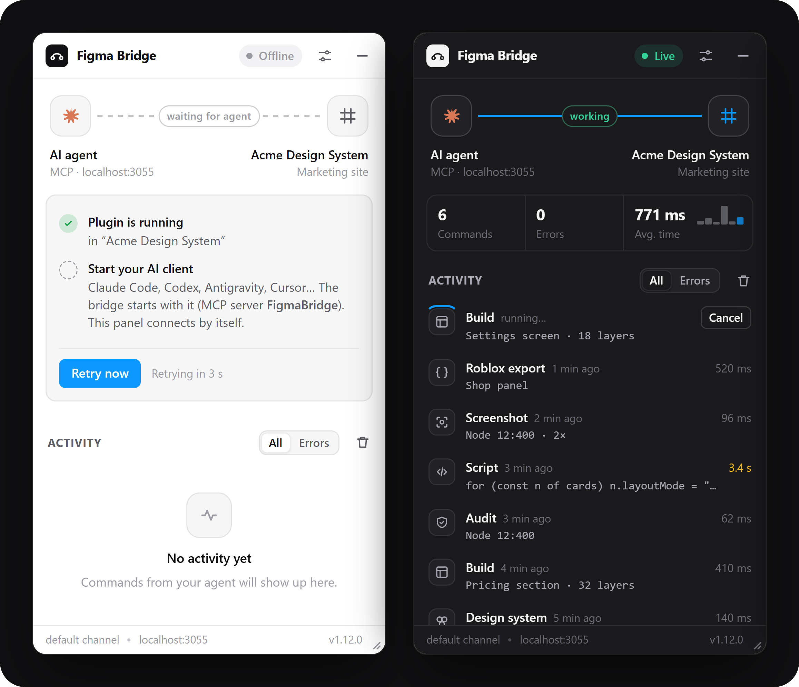

# Figma Bridge

[](https://github.com/Clovis500c/figma-bridge/actions/workflows/ci.yml)

**Let any AI agent design in the Figma desktop app, with no rate limits.**

Figma Bridge is a local [MCP](https://modelcontextprotocol.io) server plus a Figma plugin. Your agent gets full read and
write access to the open file through the Plugin API, not the web API: no tokens, no quotas. (A token is only needed
for the optional comments and version history tools.)

Works with **Claude Code**, **Claude Desktop**, **Codex**, **Antigravity**, **Gemini CLI**, **Cursor**, **Windsurf**
and any other MCP client.

<p align="center"></p>

<!-- Demo: record it with docs/record-demo.md, save it as docs/demo.gif, then uncomment.
<p align="center"></p>
-->

## Features

- **Build whole layouts in one call** from a JSON spec: auto-layout and grid, rich text, icons, images, component sets with variants and properties, prototype links.
- **Import any website or HTML** as editable auto-layout frames, one per viewport ([details](docs/import-web.md)).
- **Round-trip the design system**: write variables with Light/Dark modes and styles from JSON, W3C tokens or Tailwind; export them to DTCG, CSS, Tailwind v3/v4, SCSS or TypeScript ([details](docs/design-system.md)).
- **Score and fix design system health**: token coverage, contrast, text styles, detached instances, duplicates, naming, with safe automatic fixes.
- **Read existing designs** compactly, search every page, and reuse the file's design system.
- **Check its own work** with screenshots, a design audit, and a pixel diff against a mockup.
- **Hand off to your codebase**: export a frame into your project with its own components, tokens and stack (React, Next, Vue, Svelte, React Native; Tailwind, CSS modules, styled-components; shadcn, MUI, Chakra) ([details](docs/export-code.md)), plus Dev Mode annotations.
- **Ship to Roblox**: turn a frame into native Roblox UI (ScreenGui, UIListLayout, UICorner, UIStroke, 9-slice panels) as an `.rbxmx` model and a Luau script for a Roblox Studio MCP, with optional asset upload ([details](docs/roblox.md)).
- **Figma Design, FigJam and Slides**: stickies, shapes, connectors, tables, Mermaid flowcharts laid out as diagrams, and slide decks; several files at once ([details](docs/figjam-slides.md)).
- **200 000+ icons** through Iconify, checkpoints to roll back, and a library of reusable scripts.
- **Zero-friction connection**: the plugin connects and reconnects on its own. Each AI command is one Ctrl+Z step, and you can cancel it from the plugin.

## How it compares

| | Figma Bridge | [figma-console-mcp](https://github.com/southleft/figma-console-mcp) | [Figwright](https://github.com/awdr74100/figwright) | [Figma MCP server](https://help.figma.com/hc/en-us/articles/39216419318551-Get-started-with-the-Figma-MCP-server) (official) |
|---|---|---|---|---|
| Setup | `npx … setup` configures every AI client found and installs the plugin | npx, a personal access token, plugin import | Plugin zip import, MCP config | OAuth (remote) or the desktop app |
| Figma plan or seat | Any, free included | Any | Any, free included | Writing to the canvas: Full or Dev seat on a paid plan |
| API token | Not needed (only for comments and versions) | Required | Not needed | OAuth sign-in |
| Tools | 28 | 121 | 116 | 16 |
| Whole layout in one call | ✓ `build` spec (auto-layout, grid, variants, prototype) | Component sets from a variant matrix | — | — |
| Pixel diff against a mockup | ✓ `compare`, with heatmap | — | Diff against a saved baseline | — |
| Checkpoints to roll back | ✓ | — | — | — |
| Website or HTML → editable layers | ✓ any URL, HTML or file, several widths | — | — | Captures UI rendered in a browser |
| Code that uses your components and tokens | ✓ React, Next, Vue, Svelte, React Native | — | ✓ | ✓ with Code Connect |
| Token export | DTCG, CSS, Tailwind v3/v4, SCSS, TS, JSON | 10 formats | — | — |
| FigJam and Slides | ✓ boards, Mermaid diagrams, decks | ✓ | FigJam, partly | — |
| Figma → Roblox UI | ✓ native UI objects, `.rbxmx` + Luau, Open Cloud upload | — | — | — |

Based on each project's documentation in October 2026; "—" means it isn't documented there. Corrections are welcome
in an issue.

## Installation

Requires [Node.js](https://nodejs.org) 20+ and the Figma **desktop** app.

1. Run:

   ```bash
   npx @clovis500c/figma-bridge setup
   ```

   It adds Figma Bridge to every AI client installed on your machine (originals are backed up), copies the Figma
   plugin to `~/.figma-bridge/plugin` and prints the path of its manifest.

2. In Figma: **Plugins → Development → Import plugin from manifest…** and select that `manifest.json`.

3. Restart your AI client, open a Figma file and run **Plugins → Development → Figma Bridge**. A green **Live** badge means it's connected.

To update the plugin later, run `npx @clovis500c/figma-bridge plugin` and reopen it in Figma.

<details>
<summary>With Bun instead of npm</summary>

Download the [latest release](https://github.com/Clovis500c/figma-bridge/releases/latest), unzip it, and run in that folder:

```bash
bun install
bun run setup
```

Then import `plugin/manifest.json` in Figma as in step 2.

</details>

<details>
<summary>Manual configuration</summary>

`npx @clovis500c/figma-bridge setup --print` prints these snippets. To target one client: `setup --client codex`.

Most clients (`mcpServers` in their JSON config):

```json
{
  "mcpServers": {
    "FigmaBridge": {
      "command": "npx",
      "args": ["-y", "@clovis500c/figma-bridge"]
    }
  }
}
```

On Windows, use `"command": "cmd"` and `"args": ["/c", "npx", "-y", "@clovis500c/figma-bridge"]`.

Codex (`~/.codex/config.toml`):

```toml
[mcp_servers.FigmaBridge]
command = 'npx'
args = ['-y', '@clovis500c/figma-bridge']
startup_timeout_sec = 60
```

| Client | Config file |
|---|---|
| Claude Code | `~/.claude.json` |
| Claude Desktop | `%APPDATA%\Claude\claude_desktop_config.json` |
| Codex | `~/.codex/config.toml` |
| Antigravity | `~/.gemini/antigravity/mcp_config.json` (or **Manage MCP Servers → View raw config**) |
| Gemini CLI | `~/.gemini/settings.json` |
| Cursor | `~/.cursor/mcp.json` |
| Windsurf | `~/.codeium/windsurf/mcp_config.json` |

</details>

## Usage

Keep the plugin open (the **—** button collapses it to a thin bar) and ask your agent, for example:

> Design a mobile sign-in screen from scratch on a new page: logo, email and password fields, a primary button and a "Forgot password?" link.

> Import https://example.com/pricing at desktop and mobile widths, then rename the layers and use our text styles.

> Export the selected card into C:\code\my-app using our existing components, then write it.

> Audit our design system, fix what can be fixed safely, and tell me the score before and after.

Clients that support MCP prompts also offer ready-made workflows: **new-screen**, **apply-design-system**,
**reproduce-screenshot**, **import-website**, **figma-to-code**, **audit-and-fix** and **figma-to-roblox**. Ready-made specs and tokens are
in [examples/](examples).

When your agent needs you to point at something, the plugin shows **Your agent is waiting** until you select it.
A running command has a **Cancel** button: `build` stops at the next layer, but a script cannot be interrupted and
finishes in the background.

To reopen the plugin later, use **Ctrl+Alt+P** or the **Figma Bridge** button in the right panel.

## Tools

| Tool | Purpose |
|---|---|
| `build` | Create a layout in one call: grid, rich text, variants, reactions; FigJam boards and diagrams; slides |
| `import_web` | Rebuild a website or HTML as editable layers, one frame per viewport |
| `run_script` | Run any Figma Plugin API code |
| `describe` | Compact outline of existing layers |
| `find` | Search layers on every page by name, text, type, style or component |
| `get_design_system` | Local styles, variables and components |
| `design_tokens` | Write variables (with modes) and styles from JSON, W3C tokens or Tailwind; export them to DTCG, CSS, Tailwind, SCSS or TS |
| `audit` | Lint layers, score the design system's health, and apply safe fixes |
| `screenshot` | Export a layer to an image (optionally shown to the agent) |
| `compare` | Pixel-diff a layer against a reference image, with a heatmap |
| `wait_for_selection` | Ask the user to select layers and wait for it |
| `prototype` | Link frames (click, hover, transitions) and set flow starting points |
| `annotate` | Add, list or clear Dev Mode annotations |
| `export_code` | Export a frame to code; with `projectPath`, code that uses the project's components and tokens |
| `export_roblox` | Export a frame to Roblox UI: `.rbxmx`, a Luau builder script and PNG assets, optionally uploaded |
| `insert_icon` · `search_icons` | Iconify icons as editable vectors |
| `place_image` · `import_svg` | Images from disk or URL, SVG as vectors |
| `checkpoint` | Save layers and restore them later |
| `snippets` | Reusable script functions (`lib.name()` in scripts) |
| `get_context` · `get_css` · `list_fonts` | File info, generated CSS, installed fonts |
| `comments` · `versions` | Optional, with a Figma token: read, post and answer comments; version history and diffs ([setup](docs/rest.md)) |
| `list_sessions` · `select_session` | Choose a file when several are open (or pass `file` to any tool) |

Each tool describes its parameters to the agent, which needs no extra instructions.

## Troubleshooting

| Plugin status | Fix |
|---|---|
| **Offline** | The MCP server isn't running: start or restart your AI client and check that `FigmaBridge` is enabled. |
| **Port busy** | Another program uses port 3055. Close it; the plugin reconnects. |
| **Version mismatch** | The plugin and the server come from different releases: reopen the plugin, or update both. |

Logs, screenshots, comparison heatmaps and exported code are written to `%TEMP%\figma-bridge`.
`import_web` uses your installed Chrome or Edge; set `FIGMA_BRIDGE_BROWSER` to use another Chromium-based browser.

## Development

```bash
bun install       # also builds the plugin and dist/server.js
bun run build     # plugin/code.ts → plugin/code.js, src/cli.ts → dist/server.js (Node)
bun run check     # type-check server and plugin, reject syntax Figma cannot run
bun test          # unit tests (bridge, setup, schemas, tokens, code generation, web import, Roblox)
bun run test      # end-to-end test against an open Figma file
```

To release, change `version` in `package.json` and `server.json`, then run **Actions → Release → Run workflow** on `main`:
it publishes to npm and creates the GitHub release. Directory listings (MCP Registry, Glama, Smithery, LobeHub) are
described in [docs/publishing.md](docs/publishing.md).

Options: `FIGMA_BRIDGE_PORT` (default `3055`), `FIGMA_BRIDGE_CHANNEL`, `FIGMA_BRIDGE_OUT`, `FIGMA_BRIDGE_SNIPPETS`,
`FIGMA_BRIDGE_BROWSER`, `FIGMA_TOKEN` for the optional REST tools, and `ROBLOX_API_KEY` + `ROBLOX_CREATOR_ID` for
Roblox asset upload.
The server listens on `127.0.0.1` only, and browsers can't send it commands.
